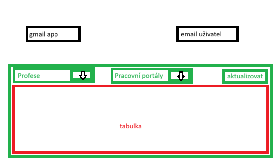

# 🔎 WorkScout

[](WorkScout_app.csproj)
[](https://dotnet.microsoft.com/)
[](https://www.microsoft.com/windows)
[](https://github.com/novakpetr1985/WorkScout_app/actions/workflows/workscout-ci-pipeline.yml)


WorkScout `1.0.0-feature` je lokální WPF aplikace pro jednoho uživatele. Jejím
cílem je spojit vyhledávání pracovních nabídek, přípravu žádostí, e-mailovou
komunikaci a sledování výsledků na jednom místě.

Verze 1.0.0 představuje první technický a uživatelský základ. Nabídky v tabulce
jsou zatím demonstrační; skutečný scraper, automatické odesílání CV ani pravidelné
čtení e-mailu tato verze ještě neobsahuje.

> Osobní desktopový asistent pro vyhledávání pracovních nabídek, přípravu žádostí
> a dohledatelnou e-mailovou komunikaci.

## 🧭 Rychlá orientace

| Oblast | Dokument |
|---|---|
| 📚 Kompletní rozcestník | [`docs/README.md`](docs/README.md) |
| 🧩 Funkce a umístění v kódu | [`docs/architecture/FEATURE_MAP.md`](docs/architecture/FEATURE_MAP.md) |
| 📝 Historie změn | [`docs/CHANGELOG.md`](docs/CHANGELOG.md) |
| 🗺️ Produktová vize | [`docs/ROADMAP.md`](docs/ROADMAP.md) |
| 🌿 Větve, PR a release | [`docs/git/BRANCH_AND_RELEASE_WORKFLOW.md`](docs/git/BRANCH_AND_RELEASE_WORKFLOW.md) |
| 🧪 Automatické a ruční testy | [`docs/testing/`](docs/testing/) |
| 🩺 Diagnostika CI | [`docs/ci/CI_DIAGNOSTIC_TEST.md`](docs/ci/CI_DIAGNOSTIC_TEST.md) |
| 📦 Poznámky k vydání | [`docs/releases/v1.0.0.md`](docs/releases/v1.0.0.md) |

Podrobnost patří pouze do příslušného tematického dokumentu; README na ni jen
odkazuje, aby se stejná pravidla neudržovala na více místech.

---

## 📦 Požadavky

- Windows 10/11 x64.
- Pro přenositelný framework-dependent build .NET 10 Desktop Runtime.
- Pro vývoj .NET 10 SDK a Visual Studio s workloadem **.NET Desktop Development**.

---

## 🚀 Spuštění aplikace

**Visual Studio**

1. Otevři `WorkScout.slnx`.
2. Obnov NuGet balíčky.
3. Sestav řešení (`Ctrl + Shift + B`).
4. Spusť projekt `WorkScout_app` (`F5`).

**Příkazová řádka**

```powershell
dotnet tool restore --configfile NuGet.Config
dotnet restore WorkScout.slnx --configfile NuGet.Config
dotnet run --project WorkScout_app.csproj
```

Při prvním spuštění lze připojit Gmail nebo zvolit **Pokračovat v ukázkovém
režimu**. Demo režim nečte ani neodesílá e-maily.

---

## ✨ Současné funkce

- Jednorázové nastavení komunikačního Gmailu a hlavního e-mailu uživatele.
- Ověření Gmail připojení přes IMAP a SMTP.
- Ochrana app passwordu pomocí Windows DPAPI.
- Ukázkový režim bez připojení e-mailu.
- Lokální SQLite databáze a EF Core migrace.
- Zapamatování vybraných pracovních portálů.
- Filtrování demonstračních nabídek podle profese a portálu.
- Rozhraní `IJobSource` pro budoucí API a scraper adaptéry.
- Databázový základ stavů žádostí a příchozí komunikace.
- Oddělené unit a integrační testy.
- Jednotná CI pipeline pro push, PR, tag, diagnostiku a release publish.

## 🚧 Omezení verze 1.0.0

- Nenačítá skutečné nabídky pracovních portálů.
- Neodesílá CV ani žádosti.
- Nečte pravidelně příchozí poštu.
- Nevytváří automatické odpovědi ani souhrny.
- Nemá ještě UI pro celý stavový tok žádosti.

---

## ✉️ Připojení Gmailu

Pro aplikaci používej samostatný Gmail účet, nikoliv hlavní osobní schránku.

1. Na samostatném účtu zapni dvoufázové ověření.
2. Na <https://myaccount.google.com/apppasswords> vytvoř app password.
3. Ve WorkScoutu zadej Gmail a app password a spusť ověření.
4. Doplň hlavní e-mail, na který mají chodit upozornění.

App password není běžné heslo ke Google účtu. WorkScout jej chrání pomocí
Windows DPAPI, takže je použitelný pouze pod stejným účtem Windows.

---

## 🔐 Data a soukromí

Uživatelská databáze je pouze lokální:

```text
%LocalAppData%\WorkScout\workscout.db
```

Databáze, přihlašovací údaje, certifikáty, lokální konfigurace a build výstupy
jsou v `.gitignore`. EF migrace naopak zůstávají verzované. Tlačítko **Změnit
nastavení** odstraní uložené e-mailové propojení a znovu otevře průvodce.

Pokud byl spuštěn starší neveřejný prototyp vytvořený přes `EnsureCreated()` a
první migrace narazí na existující tabulky, databázi nejprve zazálohuj a potom
odstraň `%LocalAppData%\WorkScout\workscout.db`. Verze 1.0.0 je první podporované
schéma.

---

## 🧩 Architektura

| Vrstva | Umístění | Účel |
|---|---|---|
| Data | `Data/` | DbContext a EF Core migrace |
| Modely | `Models/` | nastavení, portály, nabídky, žádosti a zprávy |
| Služby | `Services/` | Gmail, bezpečné uložení a zdroje nabídek |
| ViewModely | `ViewModels/` | stav a příkazy WPF obrazovek |
| UI | `Views/` | hlavní panel a průvodce nastavením |
| Unit testy | `tests/WorkScout.UnitTests/` | izolovaná logika a služby |
| Integrace | `tests/WorkScout.IntegrationTests/` | migrace, SQLite a persistence |

Hlavní knihovny: CommunityToolkit.Mvvm, Entity Framework Core SQLite a MailKit.

V kódu jsou rozšiřovací body označené jednotnými značkami `FEATURE:`,
`EXTENSION POINT:`, `DEMO DATA:`, `SECURITY:` a `RELEASE:`. Jejich význam a přesná
mapa souborů jsou v [`docs/architecture/FEATURE_MAP.md`](docs/architecture/FEATURE_MAP.md).

## 🖼️ Původní návrh hlavního panelu

Soubor [`WorkScout.png`](WorkScout.png) je původní wireframe dodaný k návrhu projektu.
Zůstává verzovaný jako reference pro další úpravy UI, nikoliv jako produkční asset.



---

## 🧪 Testy

```powershell
dotnet test WorkScout.slnx -c Release --collect:"XPlat Code Coverage"
```

Aktuální baseline: 5 unit a 3 integrační testy. Integrační sada používá vlastní
dočasnou SQLite databázi a nekontaktuje Gmail ani pracovní portály.

---

## ⚙️ GitHub Actions

Workflow `.github/workflows/workscout-ci-pipeline.yml` odpovídá vzoru ElektroOffer:

- každý push spouští rychlé unit testy,
- PR, tag a ruční běh navíc spouštějí integrační testy,
- coverage a výsledky testů se ukládají jako artefakty,
- jediná povinná souhrnná kontrola se jmenuje
  `WorkScout CI Pipeline / Build and test`,
- při chybě vznikne detailní diagnostický log,
- tag po úspěšném CI a ručním schválení environmentu `manual-approval` spustí publish.

Ochranu `dev`, `test` a `main` je nutné nastavit v GitHub Rulesets. Samotný YAML
nemůže zakázat přímý push.

---

## 🌿 Verzování a release flow

Verze je uložena pouze v `WorkScout_app.csproj`:

```xml
<Version>1.0.0-feature</Version>
<FileVersion>1.0.0.0</FileVersion>
```

Release větev postupně používá:

| Zdroj PR | Cíl PR | Hodnota `Version` |
|---|---|---|
| `release/1.0.0` | `dev` | `1.0.0-DEV` |
| `release/1.0.0` | `test` | `1.0.0-TEST` |
| `release/1.0.0` | `main` | `1.0.0` |

Přesný postup a povinné změny dokumentace jsou v
`docs/git/BRANCH_AND_RELEASE_WORKFLOW.md`.

---

## 🏗️ Lokální publish

```powershell
.\scripts\commands\run-publish.ps1
```

Skript načte verzi z `.csproj`, sestaví single-file win-x64 aplikaci a vytvoří:

```text
artifacts/publish/WorkScout-<verze>-win-x64/
artifacts/release/WorkScout-<verze>-win-x64.zip
artifacts/release/SHA256.txt
```

Výstup je framework-dependent a vyžaduje .NET 10 Desktop Runtime.

---

## ⚖️ Licence

Projekt zatím nemá přidaný licenční soubor. Do jeho doplnění není automaticky
povolena další distribuce nebo převzetí zdrojového kódu třetími stranami.
