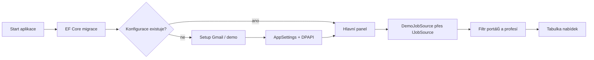

# 🧩 Mapa funkcí a rozšiřovacích bodů

Tento dokument spojuje produktové funkce WorkScout 1.0.0 s jejich skutečným
umístěním v kódu. Slouží jako rychlý rozcestník; detaily release procesu patří do
[`../git/BRANCH_AND_RELEASE_WORKFLOW.md`](../git/BRANCH_AND_RELEASE_WORKFLOW.md).

## 🔎 Značky používané v kódu

| Značka | Význam |
|---|---|
| `FEATURE:` | hotové chování používané ve verzi 1.0.0 |
| `EXTENSION POINT:` | připravené místo pro konkrétní navazující funkci |
| `DEMO DATA:` | ukázková implementace bez produkčního síťového zdroje |
| `SECURITY:` | místo pracující s credentials nebo bezpečnostním rozhodnutím |
| `RELEASE:` | pravidlo verzování nebo publikačního procesu |

Všechny značky lze najít jedním příkazem:

```powershell
rg -n "FEATURE:|EXTENSION POINT:|DEMO DATA:|SECURITY:|RELEASE:" .
```

## ✅ Funkce dostupné v 1.0.0

| Funkce | Hlavní soubory | Poznámka |
|---|---|---|
| Start a migrace DB | `App.xaml.cs`, `Data/AppDbContext.cs` | migrace proběhne před otevřením UI |
| První nastavení | `Views/SetupWizardWindow.*`, `ViewModels/SetupWizardViewModel.cs` | Gmail nebo bezpečný demo režim |
| Ověření Gmailu | `Services/EmailConnectionService.cs` | skutečné přihlášení přes IMAP i SMTP |
| Ochrana app passwordu | `Services/SecureStorageService.cs` | Windows DPAPI, scope aktuálního uživatele |
| Uzamčené e-mailové údaje | `Views/MainWindow.xaml`, `ViewModels/MainViewModel.cs` | změna pouze přes potvrzený reset |
| Výběr portálů | `Models/Portal.cs`, `ViewModels/PortalOptionViewModel.cs` | volby se ukládají do SQLite |
| Demo nabídky a filtry | `Services/DemoJobSource.cs`, `ViewModels/MainViewModel.cs` | bez scraperu a externích volání |
| Verze aplikace | `WorkScout_app.csproj`, `Services/ApplicationVersionService.cs` | `feature`, `DEV`, `TEST`, stabilní verze |
| CI a publish | `.github/workflows/workscout-ci-pipeline.yml`, `scripts/commands/run-publish.ps1` | jedna pipeline bez duplicit |

## 🧱 Datový základ připravený pro další verze

Tyto části nejsou mrtvý kód. Jsou součástí první migrace, testují se integračně a
držují stabilní tvar budoucího workflow:

| Budoucí oblast | Připravený kontrakt |
|---|---|
| Import skutečných nabídek | `IJobSource`, `JobListing`, unikátní index URL |
| Životní cyklus žádosti | `JobApplication`, `ApplicationStatus` |
| Výběr CV | `JobApplication.CvPath` |
| Příchozí pošta | `InboundMessage`, unikátní `ExternalMessageId` |
| Přiřazení odpovědi k žádosti | volitelná vazba `InboundMessage.JobApplicationId` |

## ⏳ Záměrně neimplementované funkce

- adaptéry skutečných pracovních portálů nebo scraper;
- pravidelné IMAP načítání zpráv;
- koncept, schválení a automatické odeslání CV;
- automatická odpověď s hlavním e-mailem v `Reply-To`;
- sumarizace nabídek a reporty;
- UI celého stavového toku žádosti.

Tyto body jsou produktový backlog, ne skryté chování první verze. Jejich pořadí je
v [`../ROADMAP.md`](../ROADMAP.md).

## 🔄 Tok první verze



## 🧹 Co bylo před 1.0.0 odstraněno

- dvojice starých a překrývajících se GitHub Actions workflow;
- dynamické verzování přes `Version.props` a lokální override;
- historický namespace `JobSearchApp`;
- produkční pojmenování `TestJobSource`;
- starý název aplikace v testovacím e-mailu;
- nepoužívané importy a zastaralé `TODO: DEVELOPMENT DATA` značky.
